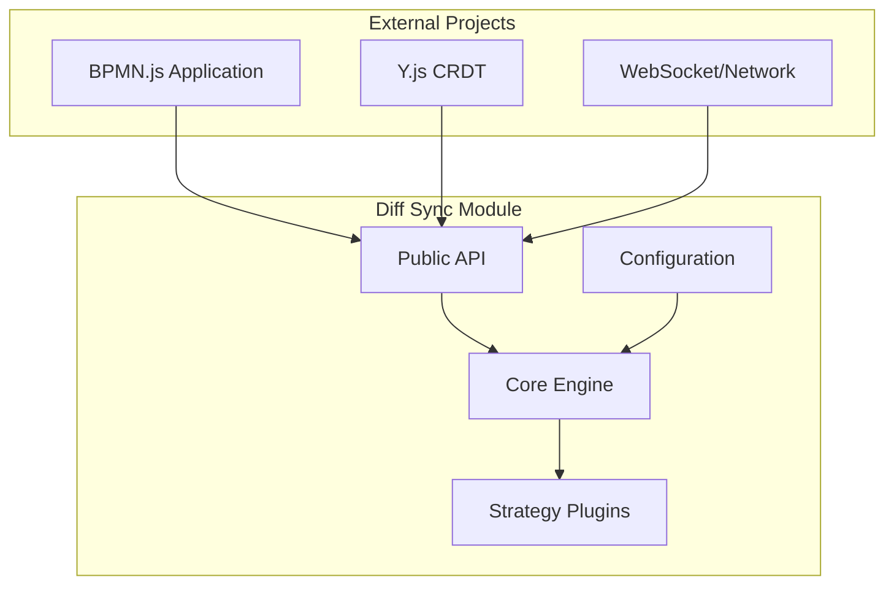

# Diff 기반 동기화 모듈 아키텍처

## 개요

BPMN.js 기반 실시간 협업 편집을 위한 독립적이고 재사용 가능한 Diff 기반 동기화 모듈의 아키텍처 설계 문서입니다. 이 모듈은 다양한 프로젝트에 쉽게 적용할 수 있도록 설계되었습니다.

## 1. 모듈 설계 원칙

### 1.1 핵심 설계 원칙

```yaml
독립성 (Independence):
  - 외부 의존성 최소화
  - 자체 완결적 동작
  - 플러그인 방식 통합

재사용성 (Reusability):
  - 다양한 BPMN.js 프로젝트 적용 가능
  - 설정 기반 커스터마이징
  - 표준 인터페이스 제공

확장성 (Extensibility):
  - 새로운 동기화 전략 추가 가능
  - 커스텀 상태 추출기 지원
  - 플러그인 아키텍처

성능 (Performance):
  - 최적화된 Diff 계산
  - 배치 처리
  - 메모리 효율성
```

### 1.2 모듈 경계 정의



## 2. 모듈 구조

### 2.1 패키지 구조

```
@bpmn-collaboration/diff-sync/
├── src/
│   ├── core/                    # 핵심 엔진
│   │   ├── DiffSyncEngine.js
│   │   ├── StateManager.js
│   │   └── EventBus.js
│   ├── extractors/              # 상태 추출 전략
│   │   ├── BpmnStateExtractor.js
│   │   ├── BaseExtractor.js
│   │   └── CustomExtractor.js
│   ├── calculators/             # Diff 계산 전략
│   │   ├── StandardDiffCalculator.js
│   │   ├── OptimizedDiffCalculator.js
│   │   └── BaseDiffCalculator.js
│   ├── applicators/             # Diff 적용 전략
│   │   ├── BpmnDiffApplicator.js
│   │   ├── SafeDiffApplicator.js
│   │   └── BaseApplicator.js
│   ├── adapters/                # 외부 시스템 어댑터
│   │   ├── YjsAdapter.js
│   │   ├── WebSocketAdapter.js
│   │   └── BaseAdapter.js
│   ├── plugins/                 # 확장 플러그인
│   │   ├── ConflictResolver.js
│   │   ├── PerformanceMonitor.js
│   │   └── ValidationPlugin.js
│   ├── utils/                   # 유틸리티
│   │   ├── Logger.js
│   │   ├── Validator.js
│   │   └── Helpers.js
│   └── index.js                 # 메인 엔트리 포인트
├── types/                       # TypeScript 타입 정의
│   ├── index.d.ts
│   ├── core.d.ts
│   └── plugins.d.ts
├── examples/                    # 사용 예제
├── test/                        # 테스트 코드
├── docs/                        # 문서
├── package.json
├── README.md
└── CHANGELOG.md
```

### 2.2 핵심 컴포넌트

#### **DiffSyncEngine (핵심 엔진)**

```javascript
// src/core/DiffSyncEngine.js
export class DiffSyncEngine {
  constructor(config = {}) {
    this.config = this._mergeConfig(config);
    this.stateManager = new StateManager(this.config.state);
    this.eventBus = new EventBus();
    
    // 전략 패턴으로 구성 요소 주입
    this.extractor = this._createExtractor(this.config.extractor);
    this.calculator = this._createCalculator(this.config.calculator);
    this.applicator = this._createApplicator(this.config.applicator);
    this.adapter = this._createAdapter(this.config.adapter);
    
    // 플러그인 시스템
    this.plugins = new Map();
    this._loadPlugins(this.config.plugins);
  }
  
  /**
   * 모듈 초기화
   * @param {Object} context - 외부 컨텍스트 (modeler, yjsDoc 등)
   */
  async initialize(context) {
    this.context = context;
    
    // 어댑터 초기화
    await this.adapter.initialize(context);
    
    // 상태 매니저 초기화
    await this.stateManager.initialize(context);
    
    // 초기 상태 캡처
    await this._captureInitialState();
    
    // 동기화 시작
    this._startSyncLoop();
    
    // 플러그인 초기화
    await this._initializePlugins();
    
    this.eventBus.emit('initialized', { engine: this });
  }
  
  /**
   * 즉시 동기화 실행
   */
  async sync() {
    try {
      const currentState = await this.extractor.extract(this.context);
      const diff = await this.calculator.calculate(this.stateManager.getLastState(), currentState);
      
      if (diff.hasChanges) {
        await this.adapter.sendDiff(diff);
        await this.stateManager.updateState(currentState);
        this.eventBus.emit('localSync', { diff });
      }
      
    } catch (error) {
      this.eventBus.emit('syncError', { error, context: 'local_sync' });
      throw error;
    }
  }
  
  /**
   * 원격 Diff 적용
   */
  async applyRemoteDiff(diff) {
    try {
      const result = await this.applicator.apply(diff, this.context);
      
      if (result.success) {
        const newState = await this.extractor.extract(this.context);
        await this.stateManager.updateState(newState);
        this.eventBus.emit('remoteSync', { diff, result });
      }
      
      return result;
      
    } catch (error) {
      this.eventBus.emit('syncError', { error, context: 'remote_sync' });
      throw error;
    }
  }
  
  /**
   * 리소스 정리
   */
  async destroy() {
    this._stopSyncLoop();
    await this._destroyPlugins();
    await this.adapter.destroy();
    this.eventBus.removeAllListeners();
  }
}
```

#### **외부 인터페이스 (Public API)**

```javascript
// src/index.js
export class BpmnDiffSync {
  constructor(options = {}) {
    this.options = this._validateOptions(options);
    this.engine = new DiffSyncEngine(this.options.engine);
    this.isInitialized = false;
  }
  
  /**
   * BPMN.js 모델러와 함께 초기화
   * @param {Object} modeler - BPMN.js 모델러 인스턴스
   * @param {Object} collaborationProvider - 협업 제공자 (Y.js 등)
   */
  async initialize(modeler, collaborationProvider) {
    if (this.isInitialized) {
      throw new Error('BpmnDiffSync already initialized');
    }
    
    const context = {
      modeler,
      collaborationProvider,
      clientId: this._generateClientId()
    };
    
    await this.engine.initialize(context);
    this.isInitialized = true;
    
    return this;
  }
  
  /**
   * 이벤트 리스너 등록
   */
  on(event, callback) {
    return this.engine.eventBus.on(event, callback);
  }
  
  /**
   * 설정 업데이트
   */
  updateConfig(newConfig) {
    return this.engine.updateConfig(newConfig);
  }
  
  /**
   * 플러그인 추가
   */
  addPlugin(plugin) {
    return this.engine.addPlugin(plugin);
  }
  
  /**
   * 즉시 동기화
   */
  async sync() {
    this._ensureInitialized();
    return this.engine.sync();
  }
  
  /**
   * 상태 스냅샷 생성
   */
  createSnapshot() {
    this._ensureInitialized();
    return this.engine.stateManager.getCurrentState();
  }
  
  /**
   * 성능 메트릭 조회
   */
  getMetrics() {
    return this.engine.getMetrics();
  }
  
  /**
   * 정리
   */
  async destroy() {
    if (this.isInitialized) {
      await this.engine.destroy();
      this.isInitialized = false;
    }
  }
}

// 기본 내보내기
export default BpmnDiffSync;

// 추가 유틸리티 내보내기
export {
  DiffSyncEngine,
  BpmnStateExtractor,
  StandardDiffCalculator,
  BpmnDiffApplicator,
  YjsAdapter
} from './src/index.js';
```

## 3. 전략 패턴 구현

### 3.1 상태 추출 전략

```javascript
// src/extractors/BaseExtractor.js
export class BaseExtractor {
  constructor(config = {}) {
    this.config = config;
  }
  
  /**
   * 현재 상태 추출 (추상 메서드)
   * @param {Object} context - 추출 컨텍스트
   * @returns {Promise<Object>} 추출된 상태
   */
  async extract(context) {
    throw new Error('BaseExtractor.extract() must be implemented');
  }
  
  /**
   * 상태 검증
   * @param {Object} state - 검증할 상태
   * @returns {boolean} 검증 결과
   */
  validate(state) {
    return state && typeof state === 'object' && state.elements;
  }
}

// src/extractors/BpmnStateExtractor.js
export class BpmnStateExtractor extends BaseExtractor {
  constructor(config = {}) {
    super(config);
    this.elementFilter = config.elementFilter || this._defaultElementFilter;
    this.propertyExtractor = config.propertyExtractor || this._defaultPropertyExtractor;
  }
  
  async extract(context) {
    const { modeler } = context;
    const elementRegistry = modeler.get('elementRegistry');
    const canvas = modeler.get('canvas');
    
    const elements = elementRegistry.getAll();
    const state = {
      timestamp: Date.now(),
      version: '1.0.0',
      elements: {},
      metadata: this._extractMetadata(canvas)
    };
    
    elements
      .filter(this.elementFilter)
      .forEach(element => {
        state.elements[element.id] = this.propertyExtractor(element);
      });
    
    if (!this.validate(state)) {
      throw new Error('Invalid state extracted');
    }
    
    return state;
  }
  
  _defaultElementFilter(element) {
    return element.type !== 'label' && 
           !element.id.startsWith('_tmp_') &&
           element.id !== '__implicitroot';
  }
  
  _defaultPropertyExtractor(element) {
    return {
      id: element.id,
      type: element.type,
      x: Math.round(element.x || 0),
      y: Math.round(element.y || 0),
      width: Math.round(element.width || 0),
      height: Math.round(element.height || 0),
      parent: element.parent?.id || null,
      businessObject: this._extractBusinessObject(element.businessObject),
      ...(element.waypoints && { waypoints: element.waypoints.map(wp => ({
        x: Math.round(wp.x), y: Math.round(wp.y)
      })) }),
      ...(element.source && { source: element.source.id }),
      ...(element.target && { target: element.target.id })
    };
  }
}
```

### 3.2 Diff 계산 전략

```javascript
// src/calculators/BaseDiffCalculator.js
export class BaseDiffCalculator {
  constructor(config = {}) {
    this.config = {
      positionTolerance: 0.5,
      enableOptimization: true,
      ...config
    };
  }
  
  /**
   * Diff 계산 (추상 메서드)
   * @param {Object} oldState - 이전 상태
   * @param {Object} newState - 현재 상태
   * @returns {Promise<Object>} 계산된 Diff
   */
  async calculate(oldState, newState) {
    throw new Error('BaseDiffCalculator.calculate() must be implemented');
  }
}

// src/calculators/StandardDiffCalculator.js
export class StandardDiffCalculator extends BaseDiffCalculator {
  async calculate(oldState, newState) {
    const diff = {
      timestamp: Date.now(),
      fromVersion: oldState?.version || '0.0.0',
      toVersion: newState.version,
      added: [],
      modified: [],
      removed: [],
      hasChanges: false
    };
    
    if (!oldState) {
      // 초기 상태
      diff.added = Object.values(newState.elements);
      diff.hasChanges = diff.added.length > 0;
      return diff;
    }
    
    const oldElements = oldState.elements || {};
    const newElements = newState.elements || {};
    
    // 변경 감지 로직
    this._detectChanges(oldElements, newElements, diff);
    
    return diff;
  }
  
  _detectChanges(oldElements, newElements, diff) {
    // 추가된 요소
    Object.keys(newElements).forEach(id => {
      if (!oldElements[id]) {
        diff.added.push(newElements[id]);
        diff.hasChanges = true;
      }
    });
    
    // 수정된 요소
    Object.keys(newElements).forEach(id => {
      if (oldElements[id]) {
        const changes = this._getElementChanges(oldElements[id], newElements[id]);
        if (changes.hasChanges) {
          diff.modified.push({
            id,
            element: newElements[id],
            changes: changes.changes
          });
          diff.hasChanges = true;
        }
      }
    });
    
    // 삭제된 요소
    Object.keys(oldElements).forEach(id => {
      if (!newElements[id]) {
        diff.removed.push(id);
        diff.hasChanges = true;
      }
    });
  }
}
```

### 3.3 어댑터 패턴

```javascript
// src/adapters/BaseAdapter.js
export class BaseAdapter {
  constructor(config = {}) {
    this.config = config;
  }
  
  async initialize(context) {
    throw new Error('BaseAdapter.initialize() must be implemented');
  }
  
  async sendDiff(diff) {
    throw new Error('BaseAdapter.sendDiff() must be implemented');
  }
  
  onRemoteDiff(callback) {
    throw new Error('BaseAdapter.onRemoteDiff() must be implemented');
  }
  
  async destroy() {
    // 기본 구현
  }
}

// src/adapters/YjsAdapter.js
export class YjsAdapter extends BaseAdapter {
  constructor(config = {}) {
    super(config);
    this.clientId = config.clientId || this._generateClientId();
  }
  
  async initialize(context) {
    this.yjsDoc = context.collaborationProvider;
    this.yElements = this.yjsDoc.getMap('elements');
    
    // 원격 변경 감지
    this.yElements.observe((event, transaction) => {
      if (transaction.origin !== this.clientId) {
        this._handleRemoteChange(event, transaction);
      }
    });
  }
  
  async sendDiff(diff) {
    this.yjsDoc.transact(() => {
      // Diff를 Y.js에 적용
      this._applyDiffToYjs(diff);
    }, this.clientId);
  }
  
  onRemoteDiff(callback) {
    this.remoteDiffCallback = callback;
  }
  
  _handleRemoteChange(event, transaction) {
    if (this.remoteDiffCallback) {
      const diff = this._convertYjsEventToDiff(event);
      this.remoteDiffCallback(diff);
    }
  }
}
```

## 4. 플러그인 시스템

### 4.1 플러그인 인터페이스

```javascript
// src/plugins/BasePlugin.js
export class BasePlugin {
  constructor(config = {}) {
    this.config = config;
    this.name = this.constructor.name;
  }
  
  /**
   * 플러그인 초기화
   * @param {DiffSyncEngine} engine - 엔진 인스턴스
   */
  async initialize(engine) {
    this.engine = engine;
    this.eventBus = engine.eventBus;
    
    // 이벤트 리스너 등록
    this._registerEventListeners();
  }
  
  /**
   * 이벤트 리스너 등록 (상속 클래스에서 구현)
   */
  _registerEventListeners() {
    // 기본 구현
  }
  
  /**
   * 플러그인 정리
   */
  async destroy() {
    if (this.eventBus) {
      this.eventBus.removeAllListeners(`plugin:${this.name}`);
    }
  }
}

// src/plugins/PerformanceMonitor.js
export class PerformanceMonitor extends BasePlugin {
  constructor(config = {}) {
    super(config);
    this.metrics = {
      syncCount: 0,
      totalSyncTime: 0,
      errors: 0,
      lastSync: null
    };
  }
  
  _registerEventListeners() {
    this.eventBus.on('localSync', this._handleSyncEvent.bind(this));
    this.eventBus.on('remoteSync', this._handleSyncEvent.bind(this));
    this.eventBus.on('syncError', this._handleErrorEvent.bind(this));
  }
  
  _handleSyncEvent(data) {
    this.metrics.syncCount++;
    this.metrics.lastSync = Date.now();
    
    if (data.timing) {
      this.metrics.totalSyncTime += data.timing;
    }
    
    // 성능 경고
    if (data.timing > this.config.slowSyncThreshold) {
      this.eventBus.emit('performance:slowSync', {
        timing: data.timing,
        threshold: this.config.slowSyncThreshold
      });
    }
  }
  
  getMetrics() {
    return {
      ...this.metrics,
      averageSyncTime: this.metrics.totalSyncTime / this.metrics.syncCount || 0,
      errorRate: this.metrics.errors / this.metrics.syncCount || 0
    };
  }
}
```

### 4.2 충돌 해결 플러그인

```javascript
// src/plugins/ConflictResolver.js
export class ConflictResolver extends BasePlugin {
  constructor(config = {}) {
    super(config);
    this.strategy = config.strategy || 'timestamp'; // timestamp, user-priority, merge
  }
  
  _registerEventListeners() {
    this.eventBus.on('conflict:detected', this._handleConflict.bind(this));
  }
  
  async _handleConflict(conflictData) {
    const { localDiff, remoteDiff } = conflictData;
    
    let resolvedDiff;
    switch (this.strategy) {
      case 'timestamp':
        resolvedDiff = this._resolveByTimestamp(localDiff, remoteDiff);
        break;
      case 'user-priority':
        resolvedDiff = this._resolveByUserPriority(localDiff, remoteDiff);
        break;
      case 'merge':
        resolvedDiff = this._mergeChanges(localDiff, remoteDiff);
        break;
      default:
        throw new Error(`Unknown conflict resolution strategy: ${this.strategy}`);
    }
    
    this.eventBus.emit('conflict:resolved', { 
      original: { localDiff, remoteDiff },
      resolved: resolvedDiff
    });
    
    return resolvedDiff;
  }
  
  _resolveByTimestamp(localDiff, remoteDiff) {
    // 최신 타임스탬프 우선
    return localDiff.timestamp > remoteDiff.timestamp ? localDiff : remoteDiff;
  }
}
```

## 5. 설정 시스템

### 5.1 기본 설정 구조

```javascript
// src/config/DefaultConfig.js
export const DEFAULT_CONFIG = {
  // 엔진 설정
  engine: {
    syncInterval: 500,
    maxBatchSize: 100,
    enableOptimization: true
  },
  
  // 상태 추출 설정
  extractor: {
    type: 'BpmnStateExtractor',
    options: {
      includeMetadata: true,
      positionPrecision: 0,
      excludeLabels: true
    }
  },
  
  // Diff 계산 설정
  calculator: {
    type: 'StandardDiffCalculator',
    options: {
      positionTolerance: 0.5,
      enableOptimization: true,
      ignoreMinorChanges: true
    }
  },
  
  // Diff 적용 설정
  applicator: {
    type: 'BpmnDiffApplicator',
    options: {
      validateBeforeApply: true,
      rollbackOnError: true,
      batchSize: 50
    }
  },
  
  // 어댑터 설정
  adapter: {
    type: 'YjsAdapter',
    options: {
      enableCompression: false,
      retryOnError: true,
      maxRetries: 3
    }
  },
  
  // 플러그인 설정
  plugins: [
    {
      type: 'PerformanceMonitor',
      options: {
        slowSyncThreshold: 100,
        enableMetrics: true
      }
    },
    {
      type: 'ConflictResolver',
      options: {
        strategy: 'timestamp'
      }
    }
  ],
  
  // 로깅 설정
  logging: {
    level: 'info',
    enableConsole: true,
    enableRemote: false
  }
};

// src/config/ConfigManager.js
export class ConfigManager {
  constructor(userConfig = {}) {
    this.config = this._mergeConfigs(DEFAULT_CONFIG, userConfig);
  }
  
  get(path) {
    return this._getNestedValue(this.config, path);
  }
  
  set(path, value) {
    this._setNestedValue(this.config, path, value);
  }
  
  update(newConfig) {
    this.config = this._mergeConfigs(this.config, newConfig);
  }
  
  _mergeConfigs(defaultConfig, userConfig) {
    // 깊은 병합 로직
    return deepMerge(defaultConfig, userConfig);
  }
}
```

## 6. 타입 정의

### 6.1 TypeScript 인터페이스

```typescript
// types/core.d.ts
export interface DiffSyncConfig {
  engine?: EngineConfig;
  extractor?: ExtractorConfig;
  calculator?: CalculatorConfig;
  applicator?: ApplicatorConfig;
  adapter?: AdapterConfig;
  plugins?: PluginConfig[];
  logging?: LoggingConfig;
}

export interface DocumentState {
  timestamp: number;
  version: string;
  elements: Record<string, ElementData>;
  metadata?: DocumentMetadata;
}

export interface DocumentDiff {
  timestamp: number;
  fromVersion: string;
  toVersion: string;
  added: ElementData[];
  modified: ModifiedElement[];
  removed: string[];
  hasChanges: boolean;
}

export interface ElementData {
  id: string;
  type: string;
  x: number;
  y: number;
  width: number;
  height: number;
  parent?: string;
  businessObject?: BusinessObjectData;
  waypoints?: Point[];
  source?: string;
  target?: string;
}

export interface SyncResult {
  success: boolean;
  appliedChanges: {
    added: number;
    modified: number;
    removed: number;
  };
  errors: SyncError[];
  warnings: SyncWarning[];
  timing?: number;
}

// types/plugins.d.ts
export interface Plugin {
  name: string;
  initialize(engine: DiffSyncEngine): Promise<void>;
  destroy(): Promise<void>;
}

export interface PerformanceMetrics {
  syncCount: number;
  averageSyncTime: number;
  errorRate: number;
  lastSync: number | null;
}
```

## 7. 사용 예제

### 7.1 기본 사용법

```javascript
// examples/basic-usage.js
import BpmnDiffSync from '@bpmn-collaboration/diff-sync';
import BpmnModeler from 'bpmn-js/lib/Modeler';
import * as Y from 'yjs';

// BPMN.js 모델러 초기화
const modeler = new BpmnModeler({
  container: '#canvas'
});

// Y.js 문서 생성
const yjsDoc = new Y.Doc();

// Diff Sync 모듈 초기화
const diffSync = new BpmnDiffSync({
  engine: {
    syncInterval: 300 // 300ms 간격으로 동기화
  },
  calculator: {
    options: {
      positionTolerance: 1.0 // 1px 이하 변경 무시
    }
  }
});

// 초기화
await diffSync.initialize(modeler, yjsDoc);

// 이벤트 리스너 등록
diffSync.on('localSync', (data) => {
  console.log('Local changes synchronized:', data.diff);
});

diffSync.on('remoteSync', (data) => {
  console.log('Remote changes applied:', data.diff);
});

diffSync.on('syncError', (data) => {
  console.error('Synchronization error:', data.error);
});

// 사용 완료 후 정리
await diffSync.destroy();
```

### 7.2 커스텀 플러그인 사용

```javascript
// examples/custom-plugin.js
import { BasePlugin } from '@bpmn-collaboration/diff-sync';

class CustomValidationPlugin extends BasePlugin {
  _registerEventListeners() {
    this.eventBus.on('beforeSync', this._validateBeforeSync.bind(this));
  }
  
  _validateBeforeSync(data) {
    const { diff } = data;
    
    // 커스텀 검증 로직
    if (diff.added.length > 10) {
      throw new Error('Too many elements added at once');
    }
    
    // 비즈니스 룰 검증
    diff.added.forEach(element => {
      if (element.type === 'bpmn:StartEvent' && this._hasStartEvent()) {
        throw new Error('Only one start event allowed');
      }
    });
  }
  
  _hasStartEvent() {
    const currentState = this.engine.stateManager.getCurrentState();
    return Object.values(currentState.elements)
      .some(el => el.type === 'bpmn:StartEvent');
  }
}

// 플러그인 사용
const diffSync = new BpmnDiffSync();
diffSync.addPlugin(new CustomValidationPlugin());
```

## 8. 패키지 배포

### 8.1 package.json

```json
{
  "name": "@bpmn-collaboration/diff-sync",
  "version": "1.0.0",
  "description": "Diff-based synchronization module for BPMN.js collaborative editing",
  "main": "dist/index.js",
  "module": "dist/index.esm.js",
  "types": "types/index.d.ts",
  "files": [
    "dist/",
    "types/",
    "README.md",
    "CHANGELOG.md"
  ],
  "scripts": {
    "build": "rollup -c",
    "test": "jest",
    "test:watch": "jest --watch",
    "test:coverage": "jest --coverage",
    "lint": "eslint src/ --ext .js",
    "type-check": "tsc --noEmit",
    "prepublishOnly": "npm run build && npm run test"
  },
  "keywords": [
    "bpmn",
    "collaboration", 
    "diff",
    "synchronization",
    "real-time",
    "crdt"
  ],
  "author": "Your Team",
  "license": "MIT",
  "peerDependencies": {
    "bpmn-js": "^10.0.0",
    "yjs": "^13.0.0"
  },
  "devDependencies": {
    "@babel/core": "^7.20.0",
    "@babel/preset-env": "^7.20.0",
    "@rollup/plugin-babel": "^6.0.0",
    "@rollup/plugin-node-resolve": "^15.0.0",
    "eslint": "^8.30.0",
    "jest": "^29.0.0",
    "rollup": "^3.0.0",
    "typescript": "^4.9.0"
  },
  "dependencies": {
    "eventemitter3": "^4.0.7",
    "lodash": "^4.17.21"
  }
}
```

## 9. 모듈의 장점

### 9.1 기술적 장점

- **독립성**: 외부 의존성 최소화로 다양한 환경에서 사용 가능
- **확장성**: 플러그인 아키텍처로 기능 확장 용이
- **재사용성**: 설정 기반으로 다양한 프로젝트에 적용 가능
- **테스트 가능성**: 모듈화된 구조로 단위 테스트 용이
- **성능**: 최적화된 Diff 계산 및 배치 처리

### 9.2 비즈니스 장점

- **빠른 적용**: 기존 프로젝트에 쉽게 통합
- **유지보수**: 중앙화된 모듈로 버그 수정 및 개선 효과적
- **일관성**: 모든 프로젝트에서 동일한 동기화 로직 사용
- **확장성**: 새로운 요구사항에 따른 플러그인 개발 가능

이 모듈 아키텍처를 통해 Diff 기반 동기화 기능을 독립적이고 재사용 가능한 형태로 구현할 수 있으며, 다양한 BPMN.js 프로젝트에 쉽게 적용할 수 있습니다.